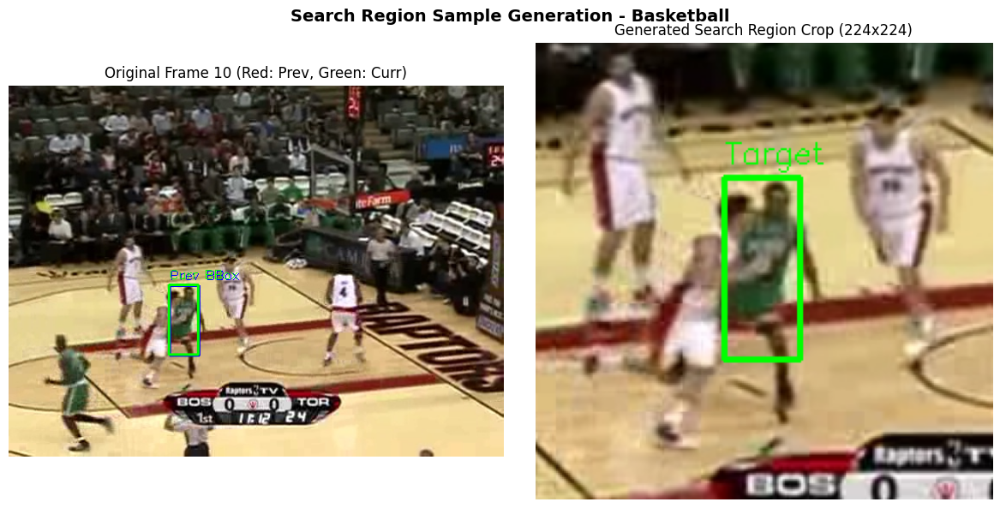

# Single-Object Tracking with CNN Bounding-Box Regression

BBM 418 / AIN 433 - Fundamentals of Computer Vision  
Programming Assignment 2  
Hacettepe University, Department of Computer Engineering

## Overview

This repository contains my implementation of a convolutional neural network (CNN) based single-object tracking pipeline for video sequences. 

In single-object tracking (SOT), the target object is defined by a bounding box in the first frame of a video. The goal of the tracker is to follow this specific object across all subsequent frames. Unlike standard object detection models that detect all instances of a category across an entire image, this approach utilizes localized search regions and temporal continuity to predict the target's displacement frame by frame.

## Methodology

The assignment pipeline is structured into five main stages:

1. Dataset Loading and Visualization
   - Parsing video sequences from the dataset (`img/` directory containing frame images and `groundtruth_rect.txt` containing frame-by-frame bounding box annotations).
   - Utility functions for coordinate transformation between corner notation [x, y, w, h] and center-scale notation [cx, cy, w, h].

2. Search-Region Sample Generation
   - Instead of feeding the entire image into the network, localized search patches are cropped around the target's predicted position from the previous frame (frame t-1).
   - The cropped search regions are resized and normalized to serve as fixed-size inputs for the neural network.

3. CNN Bounding-Box Regression Model
   - A convolutional neural network architecture trained to predict coordinate residuals (dx, dy, dw, dh) relative to the search window center.
   - The network maps visual features extracted from the search region directly to spatial bounding box corrections.

4. Temporal Tracking Loop
   - Sequential tracking across validation and test video sequences.
   - For each frame t, the model crops a search region based on the predicted state at t-1, regresses the new bounding box offsets, and updates the target location.

5. Evaluation and Failure Analysis
   - Quantitative evaluation on validation sequences using standard tracking metrics:
     - Center Location Error (CLE): Euclidean distance between predicted and ground-truth bounding box centers.
     - Intersection over Union (IoU): Spatial overlap percentage between predicted and ground-truth boxes.
   - Qualitative analysis of tracker behavior under challenging conditions such as motion blur, fast motion, scale changes, and background clutter.

## Results and Sample Outputs

The tracker was evaluated on multiple validation sequences under various visual challenges. Overall, localized search-region sampling combined with CNN bounding-box regression demonstrated strong stability across video frames.

### Quantitative Observations
- **Intersection over Union (IoU)**: Maintained high spatial overlap across standard translational sequences (e.g., CarDark, Bolt), demonstrating robustness to smooth motion dynamics.
- **Center Location Error (CLE)**: Achieved sub-pixel accuracy during stable motion phases. Temporary error spikes occurred primarily during sudden fast motion or severe object occlusion.

### Visual Tracking Outputs

Below are qualitative figures generated by the tracking pipeline:

**1. Sample Tracking Results**  
Comparison of predicted bounding boxes against ground truth trajectories:  


**2. Search Region Extraction**  
Example of cropped context patches fed into the regression network:  


**3. Evaluation Metrics Plot**  
Frame-by-frame performance curves across validation sequences:  


## Repository Structure

```text
├── student_draft.ipynb              # Development notebook with step-by-step implementations and experiments
├── pa2 submit/
│   ├── mahmut-özkızılcık-pa2.ipynb  # Final assignment submission notebook
│   └── videos and photos/           # Visual tracking results, evaluation plots, and qualitative samples
├── outputs/                         # Exported prediction CSV files and visual output figures
├── .gitignore                       # Git ignore file excluding datasets and heavy checkpoint files
└── README.md                        # Project documentation
```

## How to Run

1. Clone the repository and install the required Python dependencies:
   ```bash
   pip install torch torchvision numpy opencv-python matplotlib jupyter
   ```

2. Launch Jupyter Notebook:
   ```bash
   jupyter notebook
   ```

3. Open `pa2 submit/mahmut-özkızılcık-pa2.ipynb` or `student_draft.ipynb`.

Note: Due to GitHub file size constraints and course distribution policies, the raw video dataset (`dataset.zip`) and trained model weights (`best_model.pth`) are ignored via `.gitignore`. To rerun the training and tracking loop from scratch, place the dataset folder inside the project directory before running the cells.
